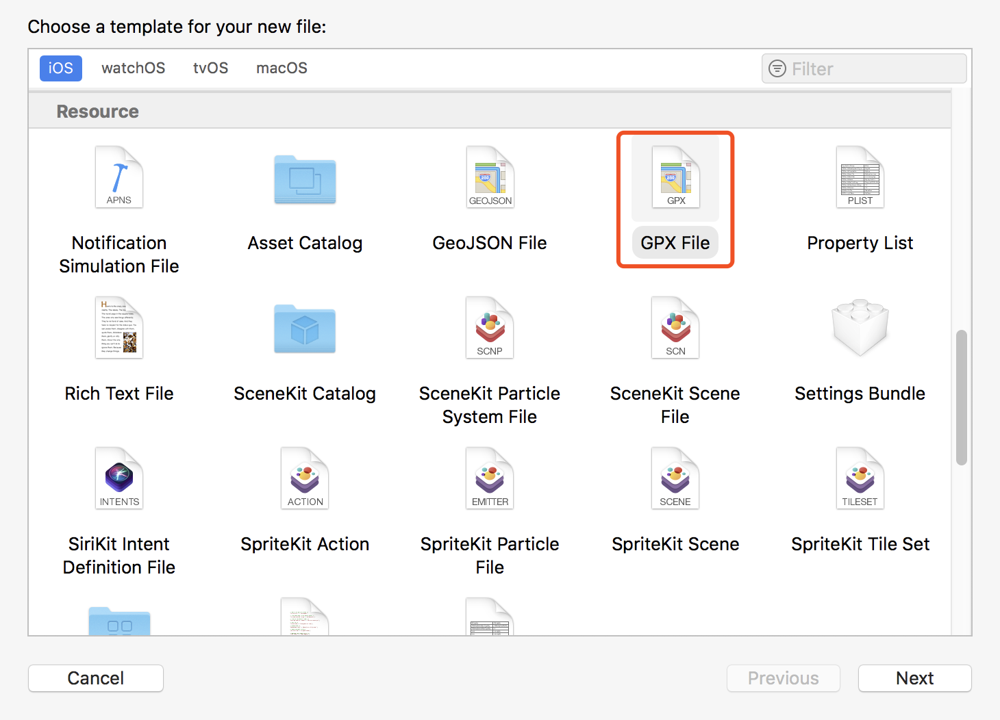

# ChangeLocation
## Summary 
This demo is used to change iPhone's location


## Usage example
Firstly,open ```ChangeLocation. xcodeproj```, connect on your iPhone.

Secondly, ```cmmand + n``` new a gpx file as below

write latitude and longitude,for exmaple```<wpt lat="xxxx" lon="xxx">```

Thirdly run the project on your real iPhone. Then chose ```Debug--Simulate Location--your gpx file```as below


Congratulations, your iPhone location has changed where you want！

## License
ChangeLocation is released under the Apache license. See the [LICENSE](LICENSE) file for more info.
